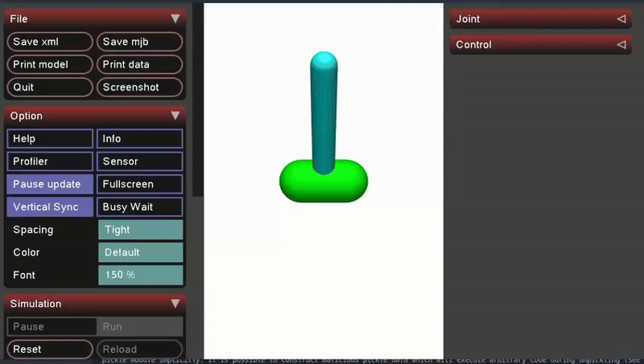

# PPO for Inverted Pendulum Control

## Project Description
Reinforcement learning agent using PPO to:
1. Swing up and balance an inverted pendulum
2. Track moving target positions
3. Optimize control efficiency

# agent after 4500 episodes and 10 epochs of training.


## Requirements
- numpy>=1.26.4
- torch>=2.5.1
- mujoco>=3.3.0
- NVIDIA GPU (recommended)

## Installation
```bash
git clone https://github.com/antwoor/ppo-pendulum.git
cd ppo-pendulum/src
pip install -e .
```

## Usage
```bash
cd src/examples
python3 dynamic_test.py
```
## Monitoring
```bash
cd src/runs
python3 tensorboadr --logfir .
```
